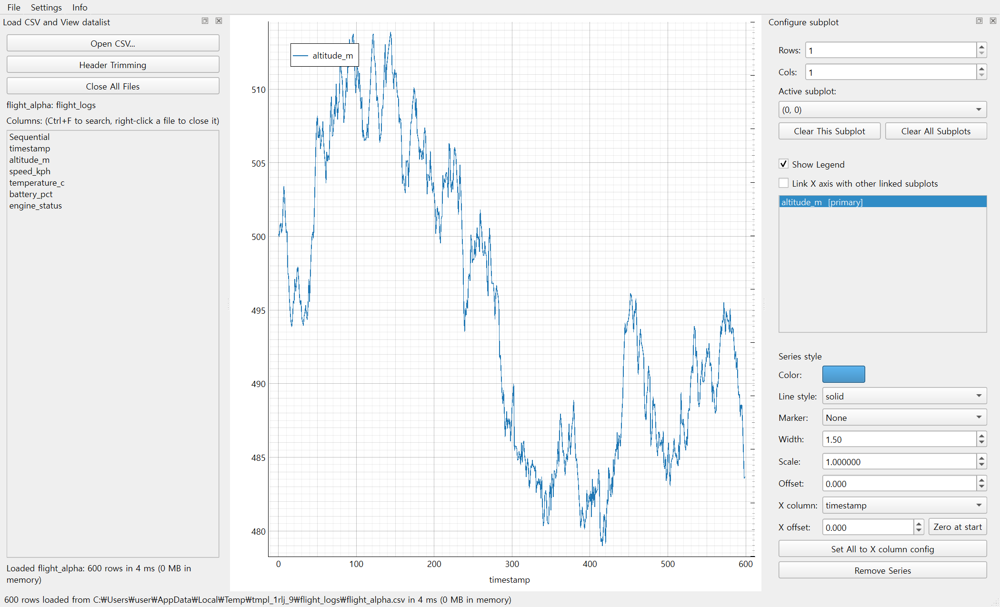
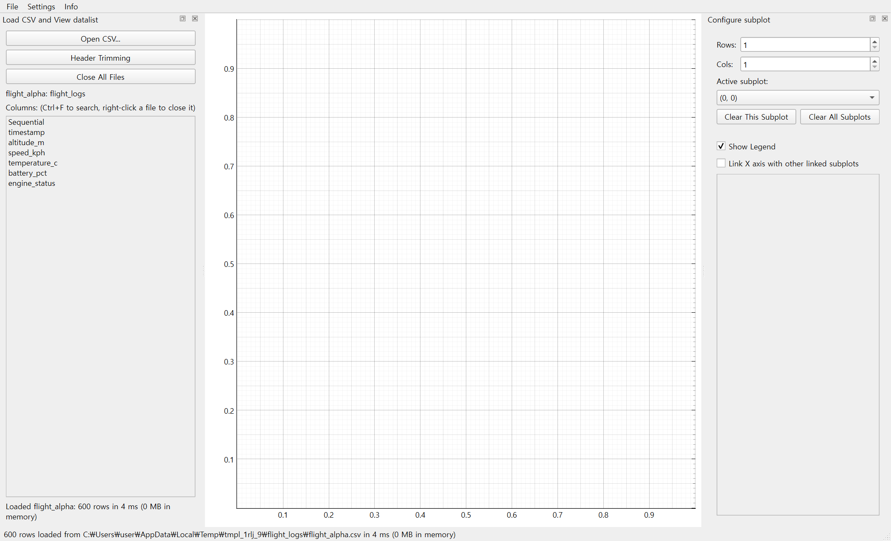
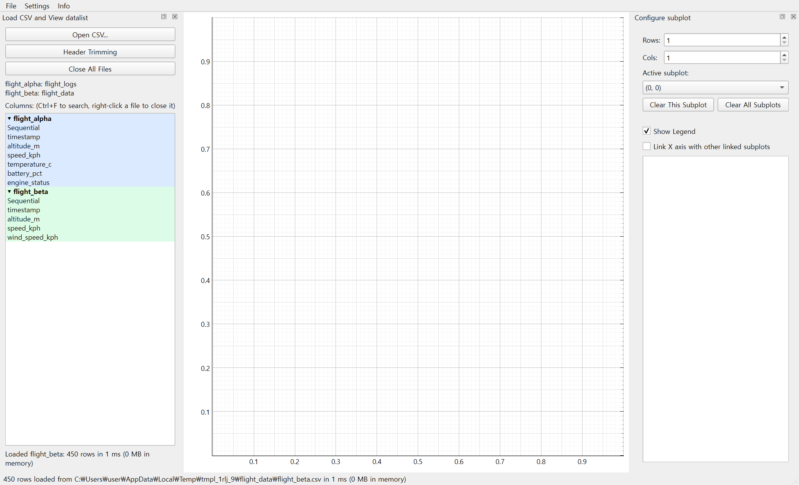
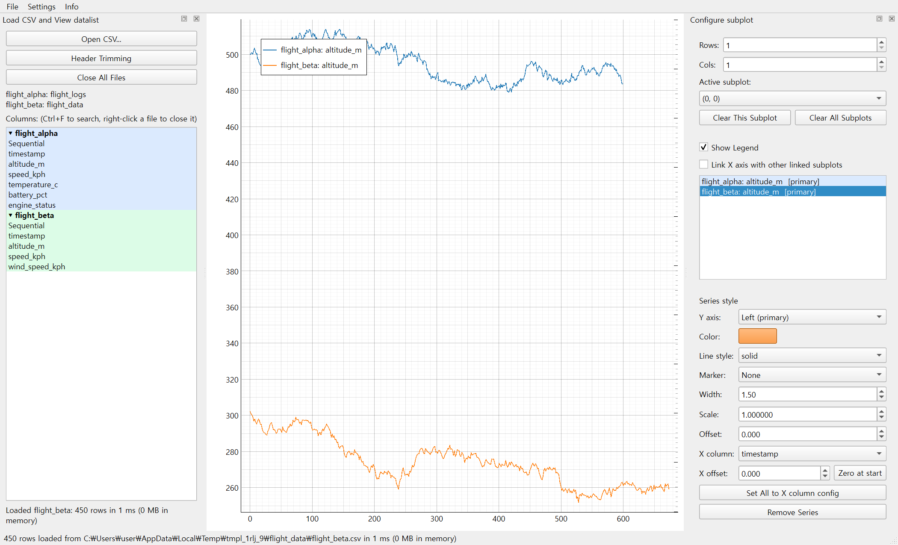
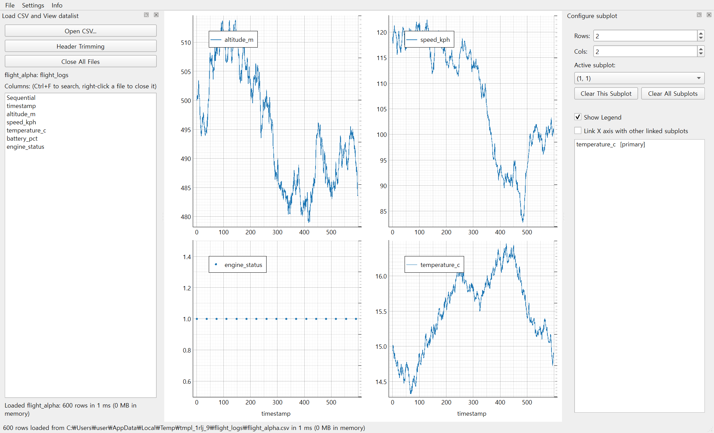
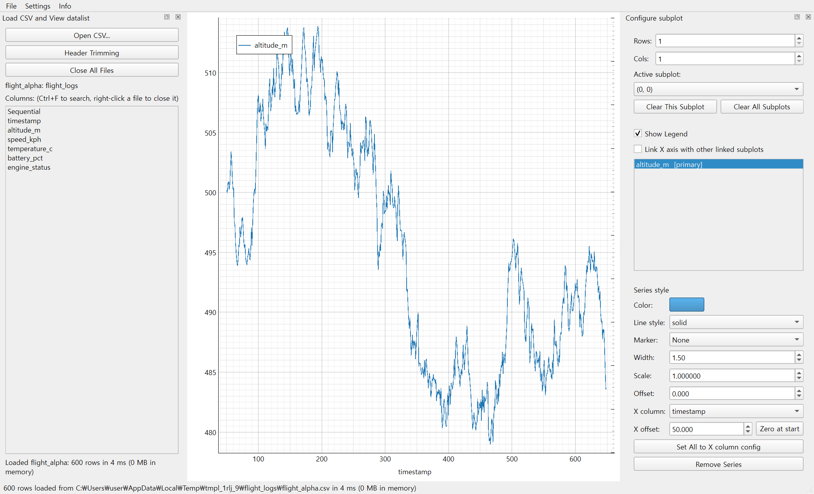
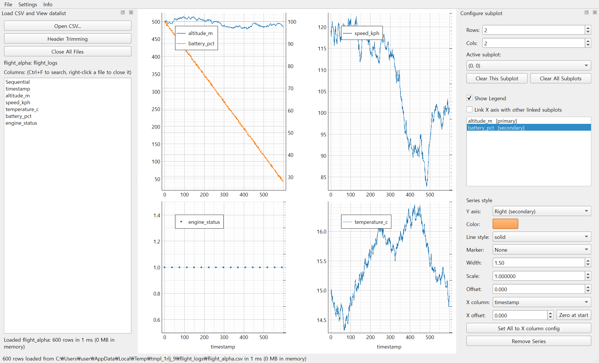

# CSV Plot Maker 사용 방법

CSV 파일을 불러와 여러 개의 subplot으로 구성된 그래프를 그리는 데스크톱 도구입니다. 이 문서는 실제로 프로그램을 켜서 사용하는 방법을 설명합니다. 내부 설계나 구현 배경이 궁금하다면 [DESIGN.md](DESIGN.md)를 참고하세요.

## 목차

- [CSV Plot Maker 사용 방법](#csv-plot-maker-사용-방법)
  - [목차](#목차)
  - [주요 특징](#주요-특징)
  - [화면 구성](#화면-구성)
  - [1. CSV 불러오기](#1-csv-불러오기)
    - [헤더 이름 정리하기 (Header Trimming)](#헤더-이름-정리하기-header-trimming)
  - [2. 여러 CSV 동시에 사용하기](#2-여러-csv-동시에-사용하기)
  - [3. subplot 그리드 구성하기](#3-subplot-그리드-구성하기)
  - [4. 그래프에 데이터 추가하기](#4-그래프에-데이터-추가하기)
  - [5. X축 설정](#5-x축-설정)
  - [6. Y축 설정 (이중 Y축 포함)](#6-y축-설정-이중-y축-포함)
  - [7. 시리즈 스타일 바꾸기](#7-시리즈-스타일-바꾸기)
  - [8. 범례(Legend)](#8-범례legend)
  - [9. 축 라벨 / 테마](#9-축-라벨--테마)
  - [10. 레이아웃 저장 및 불러오기](#10-레이아웃-저장-및-불러오기)
  - [11. 단축키 모음](#11-단축키-모음)
  - [12. 대용량 CSV 다루기](#12-대용량-csv-다루기)
  - [문제 해결](#문제-해결)

## 주요 특징

- 여러 개의 CSV를 동시에 열어두고 파일별로 색이 구분된 데이터를 자유로운 rows × cols 그리드에 함께 구성
- 한 subplot 안에 서로 다른 CSV 파일의 데이터를 섞어서 표시 가능 (각 시리즈가 항상 자기 파일의 X 데이터와 짝지어짐)
- 같은 컬럼을 여러 시리즈·여러 subplot에 중복해서 사용 가능
- 시리즈별 색상/선모양/마커/굵기를 재시작 없이 즉시 변경
- subplot마다 이중 Y축(주축/보조축) 지원, Y축 확대/축소 범위까지 레이아웃에 저장
- 좌측 컬럼 리스트·우측 시리즈 리스트 모두 다중 선택 + 드래그&드롭 지원 (같은 컬럼을 다른 subplot으로 드래그하면 "이동")
- subplot마다 원하는 조합으로만 X축 팬/줌을 동기화할 수 있는 유연한 링크 기능
- 수십만~수백만 행 규모 CSV도 빠르게 로딩·렌더링

## 화면 구성

- **① 좌측 "Load CSV and View datalist" 도크**: CSV 열기, 컬럼 목록, Header Trimming
- **② 중앙**: subplot 그리드 캔버스 (실제 그래프가 그려지는 영역)
- **③ 우측 "Configure subplot" 도크**: 위에서부터 그리드 크기 설정 → 활성 subplot의 시리즈 목록 → (시리즈를 선택했을 때만 나타나는) 스타일 편집 패널 — 색상·마커 등과 함께 그 시리즈의 X축 컬럼/오프셋도 여기서 설정합니다([5번 항목](#5-x축-설정) 참고)

창 제목 표시줄에 버전과 빌드일자가 함께 표시됩니다.

## 1. CSV 불러오기

1. 좌측 패널의 **"Open CSV..."** 버튼을 눌러 파일을 선택합니다.
2. 컬럼 목록은 파일 전체를 다 읽기 전에 즉시(스키마만 조회) 표시됩니다. 실제 데이터 파싱은 백그라운드에서 진행되며, 끝나기 전까지는 상태표시줄에 "Loading..." 안내가 뜹니다 — 이 상태에서 드래그&드롭을 시도하면 아직 데이터가 없어 추가되지 않으니 잠시 기다려 주세요.
3. 컬럼 목록 맨 위에는 항상 합성 컬럼 **`Sequential`**(1, 2, 3, ...)이 추가되어 있습니다. 쓸만한 시간/타임스탬프 컬럼이 없을 때 X축 대안으로 사용하세요.
4. 프로그램을 켜고 **처음** 여는 CSV는 subplot 구성을 깨끗한 1×1 그리드에서 시작합니다. 단, 새로 여는 CSV와 같은 이름의 저장된 레이아웃(JSON, [10번 항목](#10-레이아웃-저장-및-불러오기) 참고)이 있으면 자동으로 불러옵니다. 이후 추가로 여는 CSV는 지금 구성을 그대로 두고 옆에 더해집니다([2번 항목](#2-여러-csv-동시에-사용하기) 참고).
5. 파일이 너무 크고 가용 메모리가 부족해 보이면 로딩 전에 경고 창이 뜹니다. 계속 진행할지 여부를 선택할 수 있습니다.
6. 좌측 패널 상단에는 열려 있는 각 파일의 닉네임과, 그 파일이 있는 **폴더 이름**이 함께 표시됩니다(`닉네임: 폴더명`). 경로가 너무 길어지는 것을 막기 위해 폴더 이름까지만 보여주며, 전체 경로는 파일을 불러올 때 상태표시줄에 한 번 표시됩니다.

### 헤더 이름 정리하기 (Header Trimming)

컬럼 이름에 공통된 접두/접미사(예: 메시지 네임스페이스, `_Value` 같은 접미사)가 붙어 있어 읽기 불편하다면:

1. **"Header Trimming"** 버튼을 눌러 관리 창을 엽니다.
2. 제거하고 싶은 문자열을 입력 후 **Add**로 목록에 추가합니다. 목록에 등록된 순서대로 각 컬럼명에서 해당 문자열을 전부 제거합니다(정규식 아님, 단순 부분 문자열 제거).
3. 특정 키워드만 지우려면 목록에서 선택 후 **Remove Selected**, 전체를 비우려면 **Remove All**(확인 창이 뜹니다)을 누릅니다.
4. **주의**: 이 목록은 자동으로 저장되지 않습니다. 다음에도 재사용하려면 **"Save to File..."**로 JSON 파일에 직접 저장하고, 나중에 **"Load from File..."**로 불러오세요.
5. 프로그램을 실행 파일(.exe)로 사용 중이라면, 실행 파일과 같은 폴더에 `header_trim_keywords.json` 파일을 두면 시작할 때 자동으로 읽어옵니다(파일을 새로 만들거나 덮어쓰지는 않습니다 — 순수 읽기 전용).
6. 트리밍 결과 이름이 서로 겹치면 `_1`, `_2`처럼 자동으로 번호가 붙어 구분됩니다.

## 2. 여러 CSV 동시에 사용하기

**"Open CSV..."**를 여러 번 눌러 CSV를 계속 추가로 열 수 있습니다. 이미 그려둔 그래프는 그대로 유지된 채 새 파일의 컬럼이 추가됩니다.

- 좌측 컬럼 목록은 파일별로 묶여서 표시됩니다(굵은 글씨의 파일 이름 아래 그 파일의 컬럼들이 나열됩니다). 파일마다 자동으로 다른 배경색이 배정되고, 같은 색이 우측 "Y series in this subplot" 목록에도 그대로 적용되어 어떤 데이터가 어느 파일에서 왔는지 한눈에 구분할 수 있습니다.
- 같은 이름의 컬럼이 서로 다른 파일에 있어도 완전히 별개의 데이터로 취급되며 섞이지 않습니다. 컬럼을 다른 subplot으로 드래그해서 옮기는 기능도 파일 단위로 정확히 동작합니다.

### 파일 닉네임 바꾸기

경로나 파일 이름이 길어서 범례·시리즈 목록에 표시되는 이름을 줄이고 싶다면, 좌측 컬럼 목록에서 그 파일의 헤더 행(굵은 글씨 줄)을 **오른쪽 클릭 → Rename...**로 원하는 닉네임을 지정할 수 있습니다. 닉네임은 그 파일이 열려 있는 동안 컬럼 목록·범례·시리즈 목록·경로 표시 등 파일 이름이 쓰이는 모든 곳에 즉시 반영됩니다.

### 한 subplot에 여러 파일 섞어서 표시하기

한 subplot 안에 서로 다른 파일의 데이터를 섞어서 추가할 수 있습니다. 이 경우 범례와 시리즈 목록에 컬럼 이름 앞에 파일 이름이 함께 표시됩니다(한 파일의 데이터만 있을 때는 컬럼 이름만 표시됩니다). 두 파일의 행 개수나 시간 간격이 서로 달라도 문제없습니다 — X축 컬럼은 subplot이 아니라 **시리즈(각 데이터)마다** 따로 설정되므로([5번 항목](#5-x축-설정) 참고), 각 시리즈가 항상 자기 파일의 X 데이터와 정확히 짝지어져 그려집니다. 시리즈를 선택하면 하단 스타일 패널의 **X column** 콤보박스에도 그 시리즈가 속한 파일의 컬럼만 나타납니다(다른 파일 컬럼은 섞이지 않습니다).

서로 다른 파일의 시간축을 나란히 맞춰 비교하고 싶다면 **"Link X axis with other linked subplots"** 체크박스([5번 항목](#5-x축-설정) 참고)로 여러 subplot의 팬/줌을 동기화할 수 있습니다.

### 파일 닫기

- 더 이상 필요 없는 파일은 좌측 컬럼 목록에서 그 파일 이름을 **오른쪽 클릭 → Close**로 닫을 수 있습니다. 그 파일의 데이터를 쓰던 시리즈만 모든 subplot에서 제거되고, 그 시리즈가 있던 subplot 자체나 다른 파일의 시리즈는 영향을 받지 않습니다.
- **"Close All Files"** 버튼을 누르면 열려 있던 모든 CSV와 지금까지 구성한 그래프를 한 번에 초기화하고 완전히 처음 상태(빈 1×1 그리드)로 되돌립니다 — 새 작업을 처음부터 다시 시작하고 싶을 때 사용하세요. 되돌릴 수 없는 작업이라 확인 창이 한 번 뜹니다.

### 레이아웃과 함께 저장

레이아웃을 저장하면 그 시점에 열려 있던 모든 파일의 경로/닉네임/색상 정보도 함께 저장됩니다. 나중에 그 레이아웃을 다시 불러오면 필요한 파일들이 자동으로 다시 열립니다(이미 같은 파일이 열려 있으면 새로 열지 않고 그대로 재사용합니다). 자세한 내용은 [10번 항목](#10-레이아웃-저장-및-불러오기)을 참고하세요.

## 3. subplot 그리드 구성하기

- 우측 패널 맨 위의 **Rows/Cols** 스핀박스 값을 바꾸면 별도의 적용 버튼 없이 즉시 그리드가 재구성됩니다.
- 그래프 영역에서 원하는 subplot을 **클릭**하면 그 subplot이 "활성 subplot"이 되고, 우측 패널이 그 설정을 보여줍니다.
- **Clear This Subplot**: 활성 subplot만 초기화
- **Clear All Subplots**: 전체 subplot 초기화
- 그리드 크기를 바꿔도 기존 subplot들의 확대/축소 상태(팬/줌)는 그대로 유지됩니다.

## 4. 그래프에 데이터 추가하기

1. 좌측 컬럼 목록에서 원하는 컬럼을 원하는 subplot 위로 **드래그&드롭**하면 Y축 시리즈로 추가됩니다.
2. **여러 컬럼을 한 번에** 추가하려면: 좌측 목록에서 **Shift+클릭**(범위 선택) 또는 **Ctrl+클릭**(개별 선택)으로 여러 컬럼을 고른 뒤 한 번에 드래그하세요.
3. 같은 컬럼을 같은 subplot에 여러 번 추가하는 것도 가능합니다(예: 스타일만 다르게 두 번 표시). 중복 추가는 의도된 기능입니다.
4. 값이 드문(결측이 많은) 컬럼을 드롭하면 자동으로 **점(Dot) 마커 + 선 없음** 스타일이 적용됩니다 — 값이 거의 없는 데이터를 선으로 이었을 때 생기는 오해를 방지하기 위함입니다.
5. 우측 "Y series in this subplot" 목록에서도 **Shift/Ctrl 다중 선택**이 가능하고(단, 클릭한 채로 드래그해도 선택이 늘어나지는 않습니다), **Ctrl+A**로 전체 선택도 가능합니다. 선택한 상태에서 **Delete/Backspace** 키를 누르면 선택된 시리즈가 모두 삭제됩니다.
6. **다른 subplot으로 옮기기**: 어떤 컬럼이 이미 다른 subplot에 그려져 있는 상태에서, 그 컬럼을(좌측 목록에서든 우측 시리즈 목록에서든) 또 다른 subplot에 드래그&드롭하면 원래 있던 곳에서 지워지고 새 subplot으로 옮겨집니다(색상/선모양/마커 등 스타일과 X 컬럼/오프셋도 그대로 유지됩니다). 단, 같은 컬럼이 이미 여러 subplot에 흩어져 있으면 어디서 옮겨야 할지 애매하므로 이동시키지 않고 새로 추가만 합니다.

## 5. X축 설정

X축 컬럼은 subplot이 아니라 **시리즈(각 데이터)마다** 따로 설정합니다 — 시리즈를 선택하면 나타나는 하단 스타일 패널([7번 항목](#7-시리즈-스타일-바꾸기) 참고)에서 색상·마커 등과 함께 고릅니다. 이렇게 하면 한 subplot 안에 여러 CSV 파일의 데이터를 섞어 그려도, 각 시리즈가 항상 자기 파일의 X 데이터와 정확히 짝지어져 길이가 안 맞아 그래프가 비어 보이는 문제가 생기지 않습니다.

- **X column** 콤보박스: 선택된 시리즈가 속한 파일의 컬럼 중에서만 고를 수 있습니다(다른 파일 컬럼은 애초에 목록에 나타나지 않습니다). 기본값은 그 파일의 `timestamp` 컬럼(없으면 `Sequential`)입니다.
- **X offset**: 숫자를 직접 입력하면 이 시리즈의 X값 전체에 그만큼 더해서(또는 빼서) 표시합니다. 시간/타임스탬프 데이터를 특정 시점 기준으로 옮겨보고 싶을 때 유용합니다.
- **"Zero at start"** 버튼: 이 시리즈의 현재 X 데이터 최솟값이 0이 되도록 offset을 자동 계산합니다.
- **"Set All to X column config"** 버튼: 지금 편집 중인 시리즈의 X 컬럼과 offset을, **같은 파일에서 온 다른 모든 시리즈**(다른 subplot에 있는 것도 포함)에 한 번에 복사합니다. 화면 확대/축소 범위는 건드리지 않으므로, 적용 후 범위를 데이터에 맞추고 싶다면 각 subplot의 "A"(auto range) 버튼을 누르거나 아래 "Link X axis" 기능을 사용하세요.
- **X축 제목 자동 생략**: 그리드의 모든 subplot이 완전히 같은 X 데이터(같은 파일의 같은 컬럼 + 같은 offset)를 쓰면, 맨 아래 행의 subplot에만 X축 제목이 남고 나머지는 자동으로 비워져 그만큼 그래프 영역이 넓어집니다. 한 subplot 안에서 시리즈끼리 X가 다르면 그 subplot은 곧바로 "다름"으로 취급되고, 컬럼/offset/파일 중 하나라도 달라지면 즉시 모든 subplot에 제목이 다시 표시됩니다. 별도로 켜고 끄는 설정은 없습니다.
- **"Link X axis with other linked subplots"** 체크박스(우측 패널 중단, subplot 단위 설정): subplot마다 따로 켤 수 있습니다. 이 체크박스를 켠 subplot들끼리만 서로 팬/줌 시 X축 범위가 함께 맞춰지고(Y축은 각자 유지), 켜지 않은 subplot은 전혀 영향을 받지 않습니다 — 전체를 한꺼번에 묶는 스위치가 아니라 원하는 조합만 골라 묶는 방식입니다. 서로 다른 파일의 데이터를 나란히 놓고 시간축을 맞춰 비교할 때 유용합니다. 레이아웃 저장 시 subplot별로 이 설정도 함께 저장됩니다.

## 6. Y축 설정 (이중 Y축 포함)

- 시리즈를 선택하면 나타나는 하단 스타일 패널에서 **주축(Primary) / 보조축(Secondary)**을 지정할 수 있습니다.
- 보조축을 쓰는 시리즈가 하나라도 있으면 그 subplot의 우측에 보조 Y축이 자동으로 나타나고, 없으면 숨겨집니다.
- Y축(좌/우 모두)을 마우스로 확대·축소·이동(팬/줌)한 상태는 **레이아웃 저장 시 함께 저장**되고, 다시 불러올 때 그대로 복원됩니다. 저장된 값이 없는 subplot은 평소처럼 데이터에 맞춰 자동으로 범위가 잡힙니다.
- 각 subplot 좌하단의 **"A"(auto range) 버튼**을 누르면 언제든 데이터에 맞춰 X/Y 범위를 다시 자동으로 맞출 수 있습니다.

## 7. 시리즈 스타일 바꾸기

우측 목록에서 시리즈를 하나 클릭하면 하단에 스타일 패널이 나타납니다(위 Y축 설정 스크린샷의 우측 하단 "Series style" 영역 참고).

- **색상**, **선 스타일**(solid/dash/dot/dashdot/**none**), **마커 종류**(None/Dot/Circle/Square/Triangle/Diamond/Plus/Cross), **선 굵기**를 각각 독립적으로 바꿀 수 있습니다.
- 같은 패널 안에 이 시리즈의 **X column / X offset**도 함께 있습니다([5번 항목](#5-x축-설정) 참고) — 색상·마커와 마찬가지로 시리즈마다 따로 설정되는 값입니다.
- 선 스타일을 "None"으로 두면 선 없이 마커만 찍혀 산점도처럼 표시됩니다.
- **Scale / Offset**: 이 시리즈의 Y값에 `변환값 = 원 데이터 × Scale + Offset` 공식을 적용합니다. 단위 변환(예: ×1000)이나 캘리브레이션 보정값을 CSV를 건드리지 않고 즉시 반영하고 싶을 때 사용하세요. 기본값은 Scale=1, Offset=0(변환 없음)입니다.
  - Scale 또는 Offset을 기본값에서 바꾸면 범례에도 `컬럼명 (×Scale +Offset)` 형태로 함께 표시되어, 그래프만 보고도 원본 값이 아님을 알 수 있습니다. 기본값일 때는 컬럼명만 표시됩니다.
  - 이미 어떤 subplot에 추가되어 있는 시리즈에 대해서만 적용됩니다 — 같은 컬럼을 다른 subplot에 또 추가하면 그 시리즈는 별도로 Scale/Offset을 지정하기 전까지 기본값(변환 없음)입니다.
  - 입력란을 완전히 비운 채로 다른 곳을 클릭하면(입력을 끝맺지 못한 상태) 지우기 전 값이 아니라 기본값(Scale=1, Offset=0)으로 초기화됩니다.
- 스타일 변경은 즉시 반영되며, 대용량 데이터에서도 지연 없이 동작합니다.
- 하단의 **삭제 버튼**(또는 목록에서 Delete 키)으로 해당 시리즈를 제거할 수 있습니다.

## 8. 범례(Legend)

- **"Show Legend"** 체크박스로 표시/숨김을 전환합니다(기본 표시). subplot에 시리즈가 하나도 없으면 이 설정과 무관하게 자동으로 숨겨집니다.
- **Settings → Legend Font Size** 메뉴에서 글자 크기를 4단계(Tiny/Small/Medium/Large, 5/7/9/11pt) 중에서 고를 수 있습니다. 앱 전체(모든 subplot)에 동시 적용되며, 레이아웃 저장 시 함께 저장됩니다.
- 한 subplot 안에 서로 다른 CSV 파일의 데이터가 섞여 있으면, 범례 항목 앞에 그 데이터가 어느 파일 것인지 이름이 함께 표시됩니다([2번 항목](#2-여러-csv-동시에-사용하기) 참고). 한 파일의 데이터만 있는 보통의 경우에는 컬럼 이름만 표시됩니다.

## 9. 축 라벨 / 테마

- X축·Y축(좌/우 모두) 라벨은 그래프에서 해당 축 부분을 **더블클릭**하면 입력창이 뜹니다.
- **Settings → Theme** 메뉴에서 Light / Dark / System 모드를 선택할 수 있습니다.

## 10. 레이아웃 저장 및 불러오기

**File 메뉴**에서 제공합니다.

| 메뉴 | 동작 |
|---|---|
| Save Layout | 현재 CSV 파일명 기반 경로(`<csv 이름>.json`)에 저장 |
| Save Layout As... | 원하는 파일명으로 저장 |
| Load Layout | 현재 CSV에 대응하는 저장된 레이아웃을 불러옴 |
| Load Layout As... | 임의의 레이아웃 JSON 파일을 선택해 불러옴 (다른 CSV용으로 저장했던 레이아웃도 재사용 가능 — 지금 열려 있지 않은 파일을 참조하면 자동으로 다시 열리고, 그래도 없는 컬럼을 참조하는 시리즈는 걸러지며 몇 개가 제외됐는지 상태표시줄에 안내됩니다) |

레이아웃 파일에는 그리드 크기, 각 subplot의 라벨/범례 표시 여부/X축 링크 설정/시리즈 목록(각 시리즈의 X 컬럼·offset 포함)과 스타일/Y축 확대·축소 범위, Legend Font Size, 그리고 그 시점에 열려 있던 모든 CSV 파일의 경로/닉네임/색상 정보가 함께 포함됩니다. 컬럼을 이름으로만 참조하는 범용 포맷이라 다른 CSV에도 재사용할 수 있고, 여러 파일을 함께 쓰던 레이아웃을 불러오면 필요한 파일들이 자동으로 다시 열립니다(이미 열려 있으면 그대로 재사용).

## 11. 단축키 모음

| 단축키 | 동작 |
|---|---|
| Ctrl+F | 좌측 컬럼 목록 검색 팝업 열기 |
| Shift+클릭 (좌측 컬럼 목록) | 범위 선택 |
| Ctrl+클릭 (좌측 컬럼 목록) | 개별 컬럼 토글 선택 |
| Shift+클릭 / Ctrl+클릭 (우측 시리즈 목록) | 범위 선택 / 개별 토글 선택 |
| Ctrl+A (우측 시리즈 목록에 포커스가 있을 때) | 현재 subplot의 시리즈 전체 선택 |
| Delete / Backspace (우측 시리즈 목록) | 선택된 시리즈 전체 삭제 |
| 축 더블클릭 | 해당 축의 라벨 입력창 열기 |

## 12. 대용량 CSV 다루기

- 컬럼 목록은 스키마만 즉시 조회하므로 파일이 커도 바로 뜹니다. 실제 데이터 파싱은 백그라운드에서 진행됩니다.
- 문자열(비숫자) 컬럼은 애초에 그래프에 쓸 수 없으므로 메모리에 올리지 않습니다.
- 대용량 곡선은 화면에 보이는 범위만 렌더링(다운샘플링)해 팬/줌이 매끄럽습니다. 단, 마커가 설정된 시리즈는 개별 샘플을 정확히 보기 위해 다운샘플링을 끄고 원본 그대로 그립니다.
- 파일 크기가 가용 메모리 대비 너무 크면 로딩 전에 경고가 뜹니다.

## 문제 해결

- **드래그&드롭했는데 그래프에 아무것도 안 생겨요**: CSV가 아직 백그라운드에서 로딩 중일 수 있습니다. 상태표시줄 메시지를 확인하고 로딩이 끝난 뒤 다시 시도하세요.
- **컬럼을 추가했는데 그래프에 아무것도 안 보여요**: 값이 드문(결측이 대부분인) 컬럼일 수 있습니다. 기본으로 점(Dot) 마커가 적용되지만, 그래도 안 보이면 해당 subplot의 X/Y 범위를 "A"(auto range) 버튼으로 다시 맞춰보세요.
- **Header Trimming 목록이 다음 실행에서 사라졌어요**: 이 목록은 명시적으로 "Save to File..."을 눌러야 저장됩니다(자동 저장 없음). 실행 파일과 같은 폴더에 `header_trim_keywords.json`으로 저장해두면 다음 실행 시 자동으로 읽어옵니다.
- 그 외 라이선스 관련 정보는 **Info → License Info** 메뉴에서, 버전별 변경 이력은 **Info → Version History** 메뉴에서 확인할 수 있습니다.
